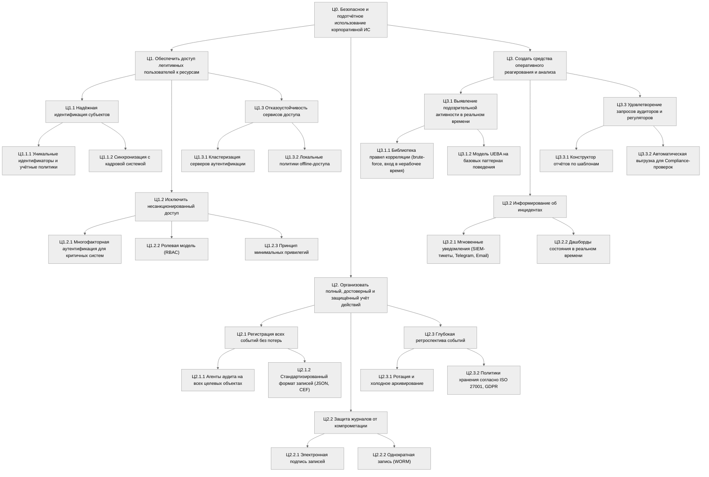
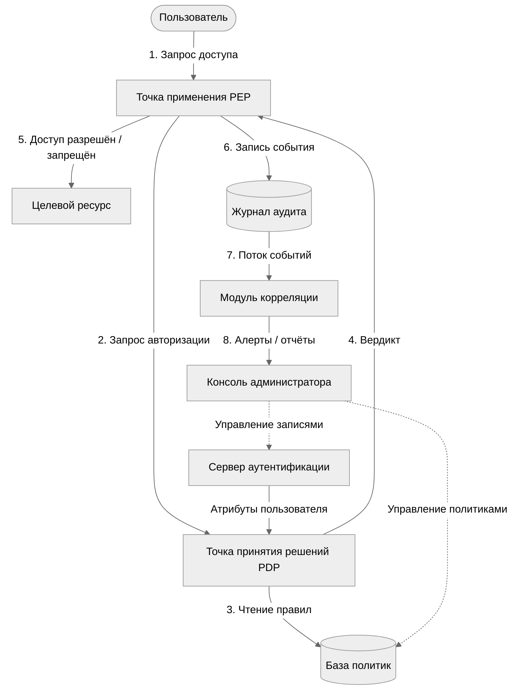
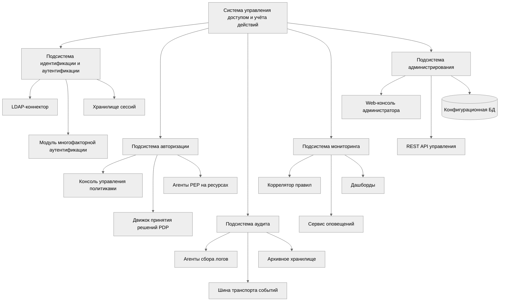
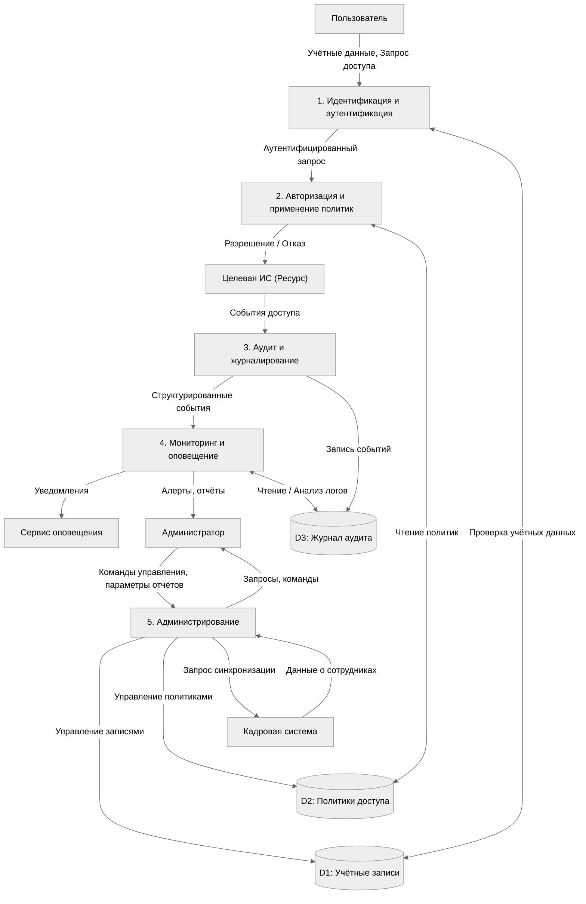
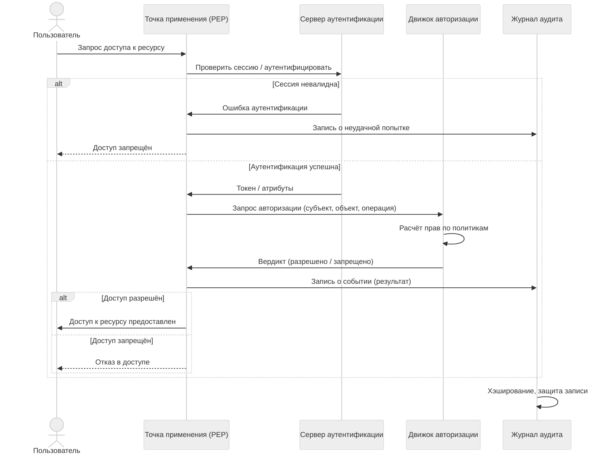
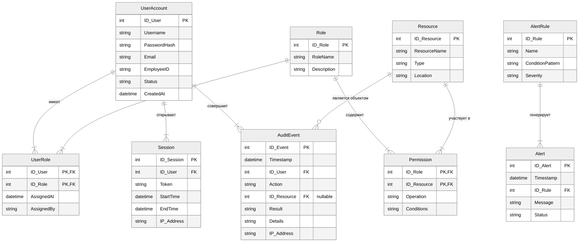
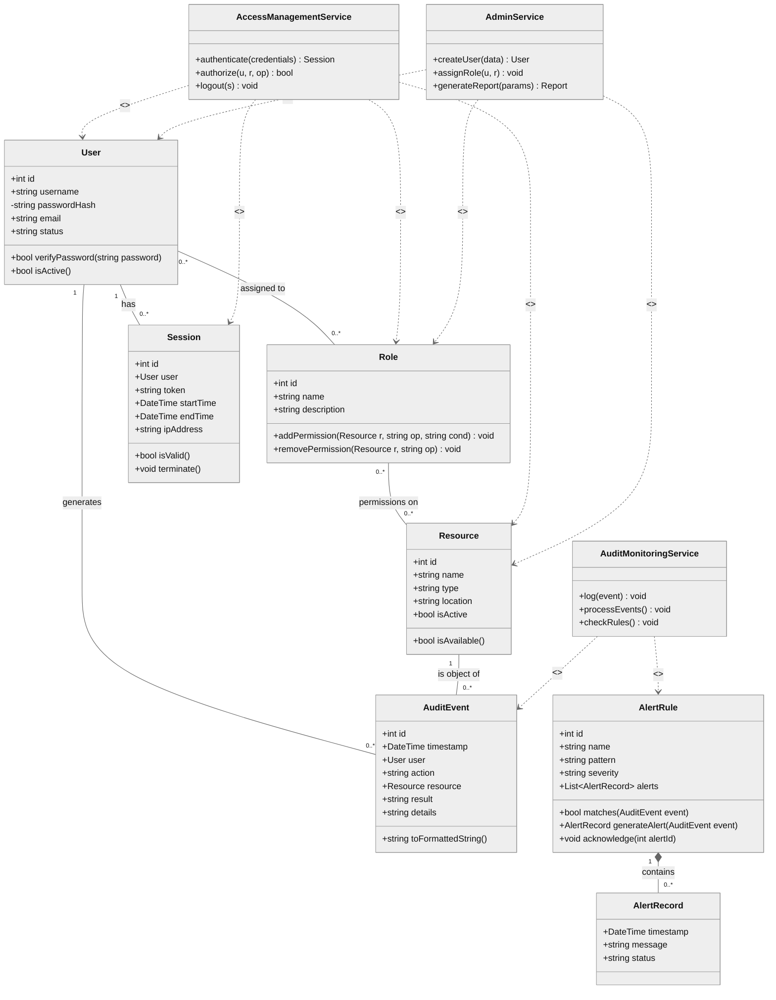
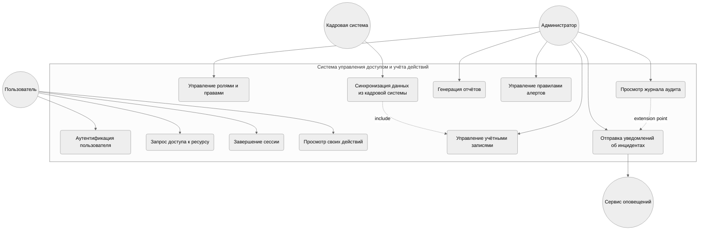
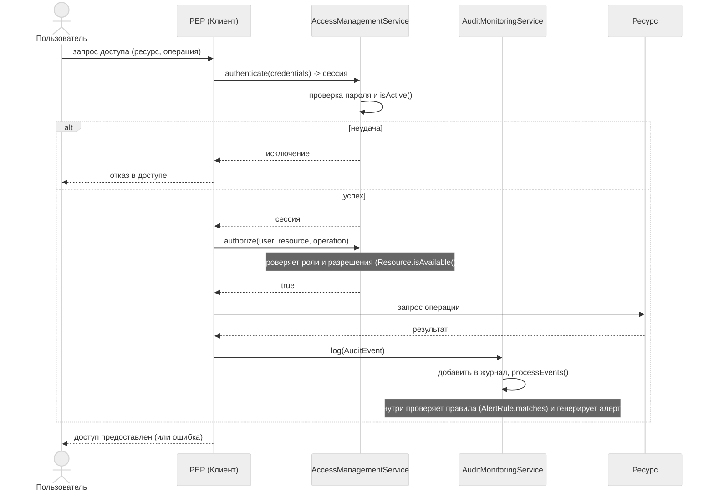

# Система управления доступом и учёта действий пользователей

## Почему эта система?

> В любой организации сотрудники ежедневно обращаются к десяткам информационных ресурсов. Без централизованного управления правами и аудита мы не знаем, кто, когда и зачем получил доступ к данным. Это не только риск утечек, но и прямое нарушение требований регуляторов. Наша задача — спроектировать систему, которая гарантирует: доступ имеет только тот, кому он действительно нужен, и каждое действие зафиксировано.

## Часть 1. Что мы строим и зачем

### Дерево целей: три направления защиты

> Проектирование любой сложной системы начинается с ответа на вопрос «зачем». Мы разложили главную цель на три направления. Это классическая триада безопасности: предотвратить несанкционированный доступ, обнаружить то, что предотвратить не удалось, и отреагировать на инцидент.

> Дерево целей — это наш стратегический план. Уровень 1 задаёт направления, уровень 2 — тактические задачи, уровень 3 — конкретные технические мероприятия. Когда через несколько слайдов мы будем смотреть на функциональные блоки IDEF0, вы увидите, что каждый блок закрывает одну из этих ветвей.

### Архитектура: пять подсистем и их связи

> Поняв цели, мы выделили пять подсистем. На этой диаграмме видно, как запрос пользователя проходит сквозь систему: от аутентификации до записи в журнал и срабатывания алерта. Обратите внимание на обратные связи — администратор не просто наблюдает, а управляет политиками, замыкая контур реагирования.

> Это первый и главный архитектурный чертёж. Пользователь — слева, ресурс — справа. Всё, что между ними: две точки принятия решений (PEP и PDP), сервер аутентификации и журнал. Пунктир от консоли администратора к базе политик — это управленческая обратная связь. Без неё система была бы статичной, а с ней администратор может реагировать на инциденты изменением правил.

### Внутреннее устройство: морфология системы

> Если предыдущая диаграмма — это «вид снаружи», то эта — «вид изнутри». Мы разобрали каждую подсистему на программные и информационные компоненты. Это нужно, чтобы разработчики понимали, какие именно модули им предстоит реализовать.

> Здесь видно, что подсистема аутентификации — это не абстракция, а конкретные LDAP-коннектор и модуль MFA. Подсистема аудита — это агенты на всех целевых ресурсах и архивное хранилище. Когда мы перейдём к ER-диаграмме, вы увидите, что каждому компоненту соответствует набор таблиц базы данных.

## Часть 2. Потоки данных и процессы

### DFD: как данные движутся по системе

> После того как мы поняли структуру, нужно смоделировать движение данных. Контекстная диаграмма потоков данных даёт ответ на вопрос: что поступает в систему извне и что мы получаем на выходе?

> Главное на этой схеме — три хранилища данных. D1 для учётных записей, D2 для политик, D3 для журнала аудита. Обратите внимание: кадровая система — внешняя сущность. Мы не дублируем функции HR, а забираем оттуда только необходимые данные. Это грамотное разграничение зон ответственности.

### Жизненный цикл запроса: от входа до аудита

> Теперь посмотрим на один конкретный сценарий — успешный запрос доступа — в динамике. Эта диаграмма последовательности показывает, кто кому и в каком порядке передаёт управление.

> Здесь два ключевых развилки. Первая: если сессия невалидна — записываем неудачу и завершаем. Вторая: если авторизация не пройдена — тоже пишем в лог, но пользователь получает отказ. Важно, что даже отказ логируется. Без этого аудит был бы неполным. И финальный штрих: журнал хэширует запись — это защита от подделки.

### IDEF0: функциональная модель

**Контекст и первый уровень**

> Теперь переходим к функциональному моделированию. IDEF0 — это строгий стандарт, где у каждого блока четыре типа стрелок. Давайте посмотрим на контекстную диаграмму и её декомпозицию.

> На контекстном уровне мы видим главную функцию и все внешние связи. Входы: запросы доступа и кадровые данные. Выходы: доступ или отказ, журнал аудита, отчёты. Управление сверху — политики безопасности и нормативные требования. Механизмы снизу — платформа IAM и администратор. На втором уровне пять функций образуют конвейер: идентификация передаёт субъекта авторизации, авторизация отдаёт факты в аудит, аудит — поток событий в мониторинг, а администрирование замыкает контур управления.

### Детализация IDEF0: авторизация и аудит

> Опустимся на уровень ниже. Авторизация состоит из двух шагов: проверить права и применить решение. Аудит — из трёх: собрать, нормализовать, сохранить.

> Проверка прав, в свою очередь, раскладывается на три атомарные операции: загрузить роли, получить разрешения, сопоставить операцию с разрешениями. Это уже уровень, понятный разработчику.

> Почему это важно? Каждый блок IDEF0 — это будущий программный модуль. Входы и выходы блоков — сигнатуры его методов. Управление — конфигурационные параметры. Механизмы — инфраструктура, на которой модуль работает.

### BPMN: процесс с точки зрения бизнеса

> IDEF0 хорош для проектирования, но для обсуждения с заказчиком нужен более наглядный язык. BPMN показывает процесс с дорожками участников и развилками.

> Здесь пять участников: пользователь, система IAM, мониторинг, сервис оповещений и администратор. Процесс начинается с запроса, проходит аутентификацию, авторизацию, и на каждом шаге пишется лог. Мониторинг анализирует события и при срабатывании правила алерта отправляет уведомление. Администратор принимает решение: нужна ли реакция.

> Обратите внимание на шлюз после аутентификации. Если пароль неверен и превышен порог попыток — учётная запись блокируется. Это не просто отказ, а активная защита от брутфорса. BPMN делает такую логику наглядной.

## Часть 3. Данные и объекты

### ER-диаграмма: структура базы данных

> Любая система работает с данными. После того как мы поняли функции и потоки, нужно спроектировать базу данных.

> В этой модели девять сущностей. UserAccount и Role связаны многие-ко-многим через таблицу UserRole — это позволяет гибко назначать права. Permission привязана к паре «роль-ресурс» — это классический RBAC. AuditEvent может ссылаться на ресурс опционально — событие входа не привязано к ресурсу, а доступ к файлу привязан. Все сущности нормализованы до 3НФ — нет дублирования, нет транзитивных зависимостей.

### UML: классы и их поведение

> ER-диаграмма — это про данные. Но в программной системе у объектов есть поведение. UML-диаграмма классов добавляет методы.

> Три сервисных класса — AccessManagementService, AuditMonitoringService, AdminService — это интерфейс системы. Сущности вроде User или AlertRule инкапсулируют данные и базовое поведение: проверить пароль, проверить сессию, сопоставить событие с правилом. Связи между классами отражают то, что мы заложили в ER-диаграмме, но добавляют зависимости по вызовам методов.

### UML: прецеденты и взаимодействие

> Теперь покажем, кто и что делает в системе. Диаграмма прецедентов — это язык для обсуждения с заказчиком.

> Пользователь — это тот, кто запрашивает доступ. Администратор управляет ролями и смотрит отчёты. Отдельно показана интеграция с кадровой системой — синхронизация данных инициируется внешним актором. Сервис оповещений — тоже внешний: мы не разрабатываем свой почтовый сервер, а используем готовый.

### UML: диаграмма последовательности

> Ключевой сценарий — успешный доступ — мы уже видели в DFD. Теперь покажем, как он выглядит в UML.

> Здесь два сервиса — AccessManagementService и AuditMonitoringService — работают последовательно. Сначала аутентификация и авторизация в AMS, затем запрос к ресурсу и только потом запись в аудит. Мониторинг запускается асинхронно внутри AMon, не блокируя пользователя. Это важная архитектурная деталь: аудит не должен замедлять доступ.

## Часть 4. Интеллектуальный анализ

### Нечёткая логика: оценка риска аутентификации

> Последний шаг — добавление интеллекта. Не все решения в системе должны быть жёсткими. Например, стоит ли запрашивать второй фактор? Это зависит от контекста: одна неудачная попытка в рабочее время с корпоративного ноутбука — вероятно, опечатка. Пять попыток в три часа ночи с нового устройства — похоже на атаку. Жёсткий порог здесь неудобен, поэтому мы применяем нечёткую логику.

### Лингвистические переменные и термы

> Мы определили три входные переменные и одну выходную. У каждой — несколько термов с функциями принадлежности. Ниже — их параметры в табличном виде.

#### Входная переменная «Число неудачных попыток» (AttemptFailures)

> Универсум: от 0 до 10 попыток за последние 5 минут.

| Терм | Тип функции | Параметры (a, b, c, d) | Интерпретация |
|------|-------------|------------------------|---------------|
| **Low** | Трапециевидная | 0, 0, 1, 2 | 0–1 попытка: норма. До 2 — ещё терпимо |
| **Medium** | Треугольная | 1, 3, 5 | Пик на 3 попытках: подозрительно |
| **High** | Трапециевидная | 4, 6, 10, 10 | От 4 попыток: вероятный брутфорс |

#### Входная переменная «Отклонение времени входа» (TimeDeviation)

> Универсум: от 0 до 12 часов отклонения от привычного графика.

| Терм | Тип функции | Параметры (a, b, c, d) | Интерпретация |
|------|-------------|------------------------|---------------|
| **Small** | Трапециевидная | 0, 0, 1, 2 | ±1 час: обычное рабочее время |
| **Medium** | Треугольная | 1, 3, 5 | 3 часа: нестандартно, но возможно |
| **Large** | Трапециевидная | 4, 7, 12, 12 | 5+ часов: ночная активность |

#### Входная переменная «Новизна устройства/геолокации» (NoveltyScore)

> Универсум: от 0 до 10 баллов.

| Терм | Тип функции | Параметры (a, b, c, d) | Интерпретация |
|------|-------------|------------------------|---------------|
| **Low** | Трапециевидная | 0, 0, 1, 2.5 | Знакомое устройство и локация |
| **Medium** | Треугольная | 1.5, 3, 5 | Частичное совпадение параметров |
| **High** | Трапециевидная | 4, 7, 10, 10 | Полностью новое окружение |

#### Выходная переменная «Уровень риска» (RiskLevel)

> Универсум: от 0 до 100%.

| Терм | Тип функции | Параметры (a, b, c, d) | Действие системы |
|------|-------------|------------------------|------------------|
| **Low** | Трапециевидная | 0, 0, 15, 25 | Доступ без ограничений |
| **Medium** | Треугольная | 20, 40, 60 | Доступ, усиленный мониторинг |
| **High** | Треугольная | 55, 75, 90 | Запросить дополнительный фактор |
| **Critical** | Трапециевидная | 80, 90, 100, 100 | Блокировка, алерт администратору |

### База правил

> 16 правил отражают логику: чем хуже показатели, тем выше риск. Используется метод Мамдани, дефаззификация — центр тяжести.

| № | Попытки | Время | Новизна | → Риск | Логика правила |
|---|---------|-------|---------|--------|----------------|
| 1 | Low | Small | Low | Low | Идеальная ситуация: всё в норме |
| 2 | Low | Small | Medium | Medium | Новизна устройства настораживает |
| 3 | Low | Small | High | Medium | Чужое устройство, но пароль верный |
| 4 | Low | Medium | Low | Low | Задержался на работе — бывает |
| 5 | Low | Medium | Medium | Medium | Нестандартное время + частично новое устройство |
| 6 | Low | Medium | High | High | Новое устройство в нерабочее время |
| 7 | Low | Large | Low | Medium | Ночной вход с обычного устройства |
| 8 | Low | Large | Medium | High | Ночь + признаки нового устройства |
| 9 | Medium | Small | Low | Medium | Несколько ошибок пароля |
|10 | Medium | Small | Medium | High | Ошибки + частично новое устройство |
|11 | Medium | Medium | Low | Medium | Ошибки + нестандартное время |
|12 | Medium | Medium | Medium | High | Три фактора средней тяжести |
|13 | Medium | High | Low | High | Много ошибок, но устройство знакомое |
|14 | Medium | Large | Medium | Critical | Почти все признаки атаки |
|15 | High | – | – | Critical | Много ошибок → блокировка независимо от остального |
|16 | – | – | High | High | Полностью новое окружение → минимум High |

> Правило 15 — стоп-правило: много неудачных попыток сами по себе означают критический риск. Правило 16: высокая новизна устройства — минимум High, независимо от остального.

### Тестирование на трёх примерах

#### Пример 1. Типичный рабочий день

| Параметр | Значение | Принадлежность термам |
|----------|----------|----------------------|
| AttemptFailures | 0 | Low = 1.0, Medium = 0, High = 0 |
| TimeDeviation | 0.5 ч | Small = 1.0, Medium = 0, Large = 0 |
| NoveltyScore | 1 | Low = 1.0, Medium = 0, High = 0 |

**Активированные правила и их вклад:**

| Правило | Условие | Вес | Активированный терм риска |
|---------|---------|-----|--------------------------|
| 1 | Low, Small, Low | 1.0 | Low (пик 15–25%) |
| 2 | Low, Small, Medium | 0 | — |
| 4 | Low, Medium, Low | 0 | — |
| 5 | Low, Medium, Medium | 0 | — |

> Доминирует правило 1 с весом 1.0 на терме Low. После дефаззификации по центру тяжести: **RiskLevel = 12.3%**.

| Результат | Значение |
|-----------|----------|
| **Чёткий риск** | **12.3%** |
| **Лингвистическая оценка** | Low (принадлежность ~0.82) |
| **Действие системы** | Доступ без дополнительных проверок |

#### Пример 2. Нестандартное время и новое устройство

| Параметр | Значение | Принадлежность термам |
|----------|----------|----------------------|
| AttemptFailures | 1 | Low = 0.5, Medium = 0, High = 0 |
| TimeDeviation | 4 ч | Small = 0, Medium = 0.67, Large = 0 |
| NoveltyScore | 6 | Low = 0, Medium = 0.6, High = 0.4 |

**Активированные правила и их вклад:**

| Правило | Условие | Вес (min) | Активированный терм риска |
|---------|---------|-----------|--------------------------|
| 6 | Low, Medium, High → High | min(0.5, 0.67, 0.4) = 0.4 | High |
| 8 | Low, Large, Medium → High | min(0.5, 0, 0.6) = 0 | — |
| 10 | Medium, Small, Medium → High | min(0, 0, 0.6) = 0 | — |
| 12 | Medium, Medium, Medium → High | min(0, 0.67, 0.6) = 0 | — |
| 16 | –, –, High → High | 0.4 | High |

> Правила 6 и 16 активируют терм High с весом 0.4 каждое. После агрегации (max) и дефаззификации: **RiskLevel = 72.5%**.

| Результат | Значение |
|-----------|----------|
| **Чёткий риск** | **72.5%** |
| **Лингвистическая оценка** | High (принадлежность ~0.7) |
| **Действие системы** | Запросить дополнительный фактор (MFA) |

#### Пример 3. Множественные неудачные попытки

| Параметр | Значение | Принадлежность термам |
|----------|----------|----------------------|
| AttemptFailures | 5 | Low = 0, Medium = 0.5, High = 0.2 |
| TimeDeviation | 1 ч | Small = 0.5, Medium = 0, Large = 0 |
| NoveltyScore | 2 | Low = 0.33, Medium = 0.17, High = 0 |

**Активированные правила и их вклад:**

| Правило | Условие | Вес (min) | Активированный терм риска |
|---------|---------|-----------|--------------------------|
| 9 | Medium, Small, Low → Medium | min(0.5, 0.5, 0.33) = 0.33 | Medium |
| 10 | Medium, Small, Medium → High | min(0.5, 0.5, 0.17) = 0.17 | High |
| 11 | Medium, Medium, Low → Medium | min(0.5, 0, 0.33) = 0 | — |
| 15 | High, –, – → Critical | 0.2 | Critical |

> Правило 15 активирует Critical с весом 0.2, правило 9 — Medium с весом 0.33, правило 10 — High с весом 0.17. Несмотря на меньший вес, терм Critical смещает центр тяжести вправо. Результат: **RiskLevel = 88.4%**.

| Результат | Значение |
|-----------|----------|
| **Чёткий риск** | **88.4%** |
| **Лингвистическая оценка** | Critical (принадлежность ~0.6) |
| **Действие системы** | Блокировка попытки, уведомление администратора |

### Сводная таблица тестирования

| Пример | Попытки | Время | Новизна | Риск | Оценка | Действие |
|--------|---------|-------|---------|------|--------|----------|
| 1. Рабочий день | 0 | 0.5 ч | 1/10 | **12.3%** | Low | Доступ без MFA |
| 2. Ночь + новый телефон | 1 | 4 ч | 6/10 | **72.5%** | High | Запросить MFA |
| 3. Брутфорс | 5 | 1 ч | 2/10 | **88.4%** | Critical | Блокировка + алерт |

> Три сценария, три разных решения, и ни одного жёсткого порога. Система сама вычисляет степень опасности и адаптирует политику безопасности. Именно это делает нечёткую логику ценным инструментом в IAM-системах: она принимает решения в условиях неопределённости так, как это делал бы опытный администратор безопасности.

## Заключение: полный цикл проектирования

> Мы прошли полный цикл системного анализа — от целей до интеллектуального компонента.
>
> - **Системный анализ** дал нам дерево целей и структуру подсистем.
> - **DFD и IDEF0** смоделировали потоки данных и функции.
> - **BPMN** показал процесс глазами бизнес-пользователя.
> - **ER-диаграмма и UML** спроектировали данные и объекты с поведением.
> - **Нечёткая логика** добавила адаптивность в принятие решений.
>
> Каждая диаграмма — это не отдельный артефакт, а слой единой модели. IDEF0-блоки находят отражение в DFD-процессах, те — в методах UML-классов, а классы — в таблицах ER-диаграммы. BPMN связывает всё это с реальным бизнес-процессом, а нечёткая логика делает систему умной, а не жёстко запрограммированной.
