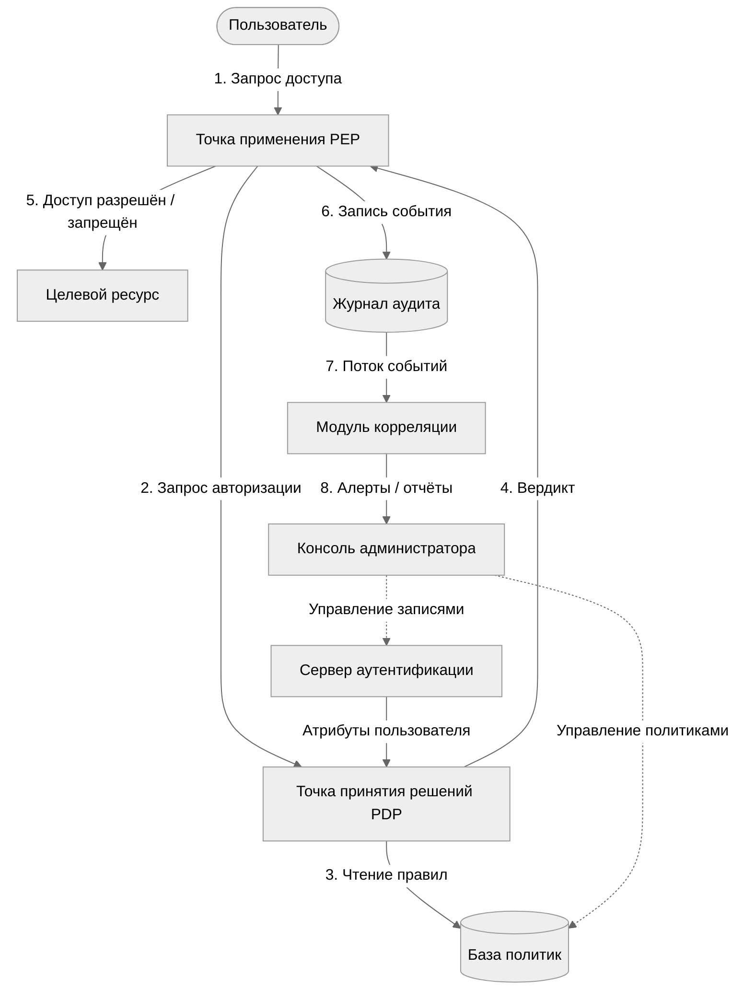
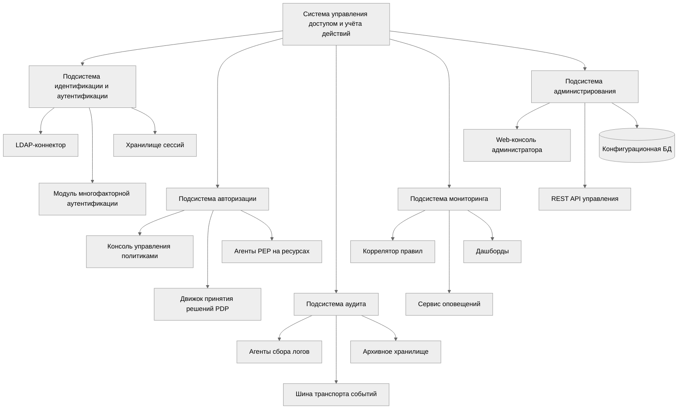
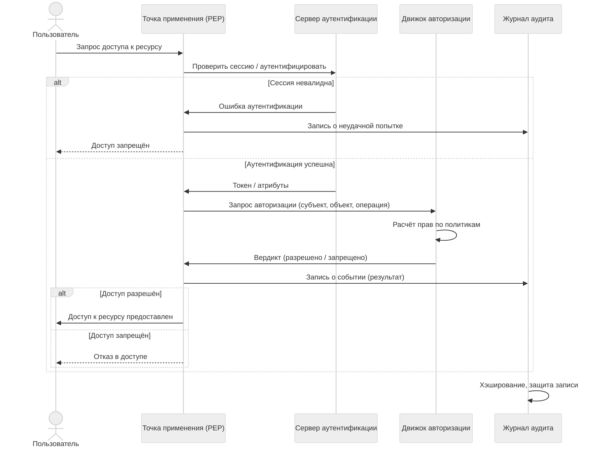
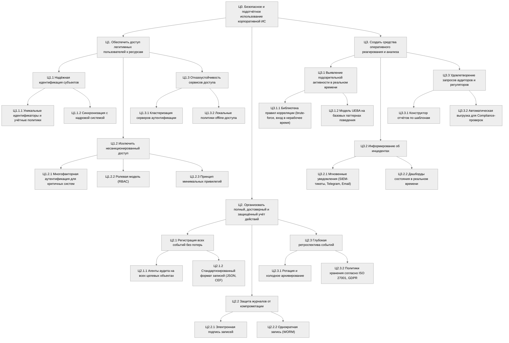

# Лабораторная работа №1  

## Задача 1. Выбор предметной области

В качестве предметной области выбрана **система управления доступом и учёта действий пользователей в корпоративной информационной системе (ИС)**.  

**Обоснование:**  
Любая организация, использующая информационные ресурсы, нуждается в разграничении прав сотрудников, защите данных и отслеживании операций. Система такого класса сочетает аутентификацию, авторизацию, аудит и мониторинг, является сложной и многокомпонентной, что делает её удобным объектом для системного анализа.

## Задача 2. Системный анализ: цели, подсистемы, элементы, связи

### Главная цель системы
Обеспечить санкционированный, контролируемый доступ пользователей к ресурсам ИС и зафиксировать все значимые действия для последующего анализа и расследования инцидентов.

### Подсистемы
1. **Идентификация и аутентификация** – проверка подлинности субъекта.
2. **Авторизация и управление политиками** – принятие решений о доступе на основе ролей, правил, атрибутов.
3. **Аудит и журналирование** – регистрация событий безопасности и защищённое хранение логов.
4. **Мониторинг и оповещение** – анализ событий в реальном времени и уведомления об инцидентах.
5. **Администрирование** – управление учётными записями, ролями, политиками.

### Ключевые элементы
- Хранилище учётных записей (LDAP / AD)
- База политик доступа
- Сервер аутентификации (Kerberos, OAuth, RADIUS)
- Точка принятия решений (Policy Decision Point, PDP)
- Точка применения решений (Policy Enforcement Point, PEP) – агенты на целевых ресурсах
- Журнал аудита (SIEM-коллектор)
- Модуль корреляции событий
- Консоль администратора

### Связи между элементами (информационные потоки)
```
Пользователь → PEP (запрос доступа)
PEP → PDP (запрос авторизации)
PDP → Хранилище политик (чтение правил)
PDP → PEP (разрешение/запрет)
PEP → Журнал аудита (запись события)
Сервер аутентификации → PDP (атрибуты субъекта)
Журнал → Модуль корреляции (поток событий)
Модуль корреляции → Консоль администратора (алерт, отчёт)
```

### Диаграмма связей подсистем и потоков (Mermaid)



## Задача 3. Морфологическое и функциональное описание системы

### 3.1 Морфологическое описание (состав и иерархия)

Морфология системы раскрывает её внутреннее устройство – программные, информационные и интерфейсные компоненты.

**Диаграмма состава системы (иерархия подсистем и компонентов):**



**Основные информационные объекты:**  
- Учётная запись (ID, атрибуты, хэш пароля)  
- Роль  
- Политика (правило: субъект – операция – объект – условия)  
- Событие аудита (время, субъект, действие, объект, результат)  
- Сессия пользователя

### 3.2 Функциональное описание (процессы)

Функциональная модель показывает, какие действия система выполняет над входными данными.

**Основные функции:**  
- **F1** – Идентификация субъекта  
- **F2** – Аутентификация  
- **F3** – Авторизация (вычисление прав)  
- **F4** – Регистрация событий в журнале  
- **F5** – Управление политиками и ролями  
- **F6** – Защита целостности логов  
- **F7** – Корреляция событий и выявление инцидентов  
- **F8** – Формирование отчётов

**Диаграмма последовательности основных процессов (функциональный поток):**



## Задача 4. Дерево целей и декомпозиция главной цели

Главная цель системы декомпозирована на три ветви (уровень 1), каждая из которых детализируется до конкретных технических и организационных подцелей (уровни 2 и 3).

**Диаграмма «Дерево целей» (Mermaid):**



**Характеристика уровней:**  
- **Уровень 1 (Ц1, Ц2, Ц3)** – три фундаментальные подцели, реализующие модель «Предотвращение – Обнаружение – Реагирование».  
- **Уровень 2** – тактические цели, привязанные к подсистемам (ролевая модель, защита логов, корреляция).  
- **Уровень 3** – конкретные технические и организационные мероприятия, реализуемые компонентами системы.
