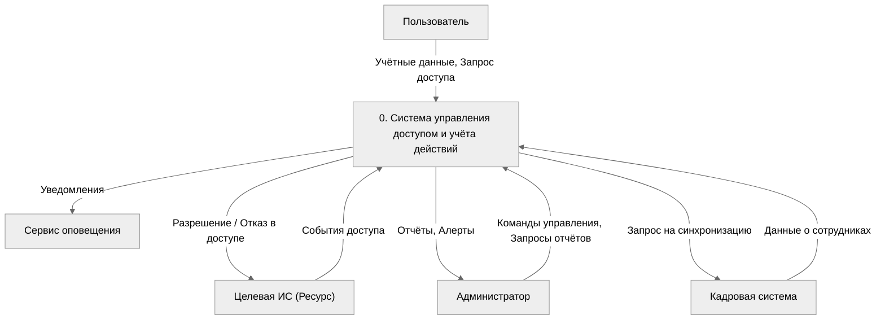
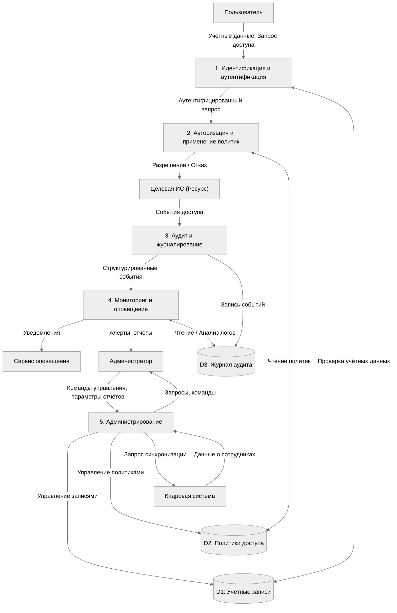
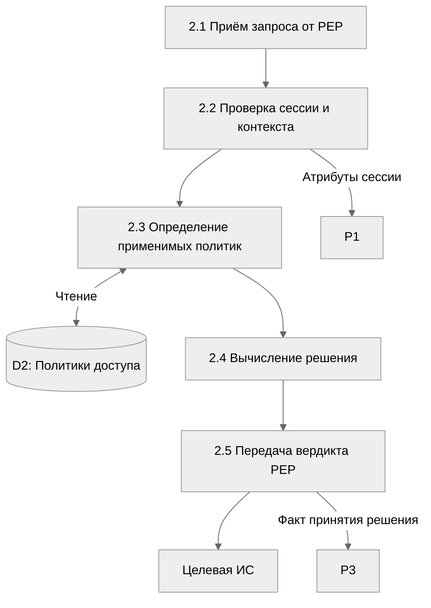
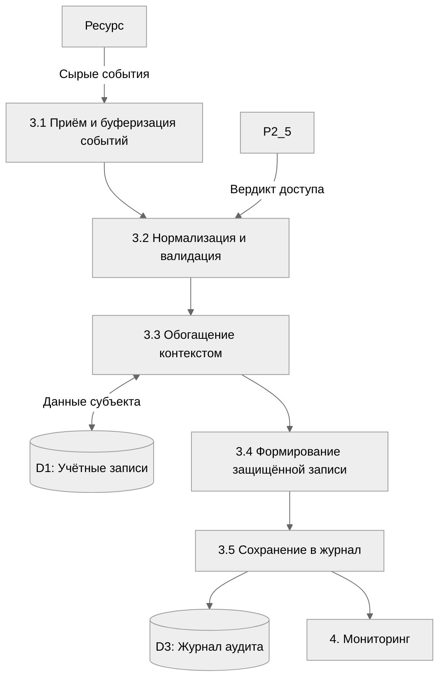

# Лабораторная работа №2  
**Тема:** Построение диаграмм потоков данных (DFD) для системы управления доступом и учёта действий пользователей

**Цель:** Освоить методологию моделирования потоков данных и построить иерархию DFD.

## Задача 1. Контекстная DFD (уровень 0)

Контекстная диаграмма представляет систему как единый процесс, взаимодействующий с внешними сущностями.

**Внешние сущности:**
- **Пользователь** – сотрудник, запрашивающий доступ к ресурсам.
- **Администратор** – управляет политиками, просматривает отчёты и алерты.
- **Целевая информационная система (Ресурс)** – защищаемый ресурс, к которому осуществляется доступ.
- **Кадровая система** – источник учётных данных сотрудников.
- **Сервис оповещения** – внешний сервис email/SMS/мессенджеров для рассылки уведомлений.

**Основные потоки данных** (входные/выходные):
- Запрос на доступ, учётные данные, результат доступа, информация о событиях.
- Команды управления политиками, ролями, учётными записями.
- Отчёты, алерты, уведомления.
- Синхронизация учётных данных из кадровой системы.

## Задача 2. Детализация процессов (уровень 1)

На уровне 1 главный процесс декомпозируется на пять функциональных подсистем, соответствующих результатам ЛР1. Вводятся внутренние хранилища данных.

**Процессы уровня 1:**
1. **Идентификация и аутентификация** – проверка подлинности пользователя.
2. **Авторизация и применение политик** – принятие решения о доступе.
3. **Аудит и журналирование** – сбор, защита и хранение записей о событиях.
4. **Мониторинг и оповещение** – анализ логов, выявление инцидентов, рассылка уведомлений.
5. **Администрирование** – интерфейс управления учётными записями, политиками и генерации отчётов.

**Хранилища данных:**
- D1 – **Хранилище учётных записей** (LDAP/AD).
- D2 – **База политик доступа**.
- D3 – **Журнал аудита**.

## Задача 3. Иерархия DFD (уровень 2)

Декомпозиция отдельных процессов до элементарных функций показана на примере двух ключевых подсистем:
- **Процесс 2 «Авторизация и применение политик»**
- **Процесс 3 «Аудит и журналирование»**

### 3.1 Декомпозиция процесса 2: Авторизация

### 3.2 Декомпозиция процесса 3: Аудит

## Задача 4. Проверка модели на полноту и согласованность

Проверка выполнена по следующим критериям:

1. **Соответствие потоков между уровнями:**
   - Все входные и выходные потоки контекстной диаграммы сохранены на уровне 1 и распределены между процессами 1, 2, 3, 4, 5.
   - Потоки «Запрос доступа», «Разрешение/Отказ», «События доступа», «Команды управления», «Отчёты», «Уведомления», «Синхронизация кадровых данных» явно прослеживаются.

2. **Сбалансированность хранилищ:**
   - Каждое хранилище (D1, D2, D3) на уровне 1 имеет входящие и исходящие потоки.
   - На уровне 2 процесса 2 используется только чтение из D2, что соответствует его функции.
   - В процессе 3 производится запись в D3, а также чтение из D1 для обогащения, что логично.

3. **Отсутствие «висячих» процессов:**
   - Все процессы уровня 1 имеют входы и выходы.
   - Процесс 5 «Администрирование» инициирует управляющие воздействия и потребляет внешние команды; в уровне 2 не показан, так как его декомпозиция тривиальна (CRUD-операции), но при необходимости может быть детализирована.

4. **Нотация и именование:**
   - Наименования процессов соответствуют глагольным конструкциям (действиям).
   - Внешние сущности поименованы осмысленно.
   - Стрелки подписаны, потоки данных отражают перемещение информации, а не физических объектов.

5. **Целостность декомпозиции:**
   - Дочерние диаграммы уровня 2 полностью вписываются в родительский процесс: сумма входных/выходных потоков процесса 2 на уровне 1 (аутентифицированный запрос, чтение политик, разрешение/отказ, запись факта в аудит) соответствует элементам 2.1–2.5. Аналогично для процесса 3.

Таким образом, модель DFD является полной, сбалансированной и непротиворечивой.
