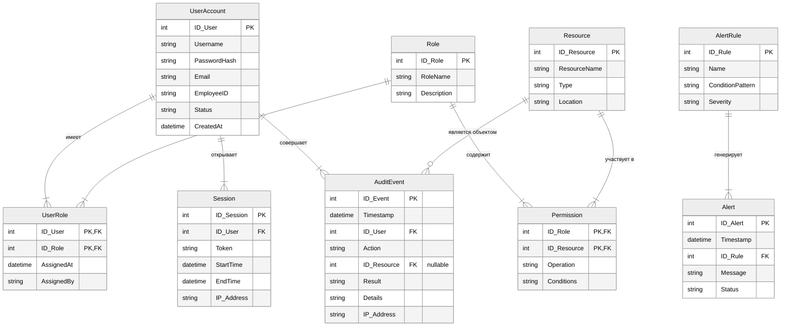

# Лабораторная работа №3  
**Тема:** Моделирование данных с использованием ER-диаграмм для системы управления доступом и учёта действий пользователей

**Цель:** Освоить методологию IDEF1X/ER-моделирования.

## Задача 1. Выделение сущностей, атрибутов и связей

На основе анализа предметной области выделены следующие сущности.

### Словарь сущностей

| Сущность | Описание | Основные атрибуты |
|----------|----------|-------------------|
| **UserAccount** | Учётная запись пользователя (субъект доступа) | `ID_User` (PK), Username, PasswordHash, Email, EmployeeID, Status, CreatedAt |
| **Role** | Роль, объединяющая набор полномочий | `ID_Role` (PK), RoleName, Description |
| **Resource** | Защищаемый информационный ресурс | `ID_Resource` (PK), ResourceName, Type, Location |
| **Permission** | Разрешение на операцию с ресурсом, назначенное роли | `ID_Role` (PK, FK), `ID_Resource` (PK, FK), Operation, Conditions |
| **UserRole** | Назначение пользователю роли | `ID_User` (PK, FK), `ID_Role` (PK, FK), AssignedAt, AssignedBy |
| **Session** | Активная сессия аутентифицированного пользователя | `ID_Session` (PK), `ID_User` (FK), Token, StartTime, EndTime, IP_Address |
| **AuditEvent** | Запись о событии безопасности | `ID_Event` (PK), Timestamp, `ID_User` (FK), Action, `ID_Resource` (FK, nullable), Result, Details, IP_Address |
| **AlertRule** | Правило корреляции для выявления инцидентов | `ID_Rule` (PK), Name, ConditionPattern, Severity |
| **Alert** | Сгенерированное оповещение об инциденте | `ID_Alert` (PK), Timestamp, `ID_Rule` (FK), Message, Status |

### Связи между сущностями

- **UserAccount – UserRole:** один ко многим (1:M). Один пользователь может иметь несколько назначений ролей.
- **Role – UserRole:** один ко многим (1:M). Одна роль может быть назначена многим пользователям.
- **Role – Permission:** один ко многим (1:M). Одна роль включает множество разрешений.
- **Resource – Permission:** один ко многим (1:M). Один ресурс фигурирует во многих разрешениях.
- **UserAccount – Session:** один ко многим (1:M). Один пользователь инициирует множество сессий.
- **UserAccount – AuditEvent:** один ко многим (1:M). От одного пользователя регистрируется множество событий.
- **Resource – AuditEvent:** один ко многим (1:M), но связь опциональна (события вроде login не связаны с ресурсом).
- **AlertRule – Alert:** один ко многим (1:M). Одно правило генерирует множество оповещений.

## Задача 2. ER-диаграмма в нотации IDEF1X (адаптирована для Mermaid)

На диаграмме прямоугольниками представлены сущности, перечислены их атрибуты. Первичные ключи (PK) подчёркнуты, внешние ключи (FK) отмечены. Связи показаны с указанием кардинальности («один» – `||`, «много» – `{`).

## Задача 3. Нормализация модели данных до 3НФ

Все сущности приведены к третьей нормальной форме. Ниже обоснование для каждой.

- **UserAccount:** неключевые атрибуты (Username, Email, PasswordHash, EmployeeID и т.д.) функционально полно зависят от первичного ключа `ID_User`. Нет транзитивных зависимостей (EmployeeID уникален, но не определяет другие атрибуты).
- **Role:** аналогично, все атрибуты зависят только от `ID_Role`.
- **Resource:** атрибуты зависят только от `ID_Resource`.
- **Permission:** первичный ключ составной (`ID_Role`, `ID_Resource`). Неключевые атрибуты Operation и Conditions зависят от всей совокупности ключа (разрешение определено конкретной парой роль-ресурс). Транзитивных зависимостей нет.
- **UserRole:** аналогично, составной ключ (`ID_User`, `ID_Role`), атрибуты AssignedAt и AssignedBy зависят от полной комбинации.
- **Session:** неключевые атрибуты (Token, StartTime, EndTime, IP_Address) зависят от `ID_Session`; `ID_User` является внешним ключом и не порождает транзитивной зависимости.
- **AuditEvent:** все неключевые атрибуты зависят от `ID_Event`. Внешний ключ `ID_User` (и nullable `ID_Resource`) не создают зависимости между неключевыми атрибутами.
- **AlertRule:** атрибуты зависят от `ID_Rule`.
- **Alert:** атрибуты зависят от `ID_Alert`; `ID_Rule` – внешний ключ.

Таким образом, модель находится в 3НФ: устранены повторяющиеся группы (1НФ), все неключевые атрибуты зависят от полного первичного ключа (2НФ), отсутствуют транзитивные зависимости неключевых атрибутов от первичного ключа (3НФ).

## Задача 4. Описание типов связей

В IDEF1X различают идентифицирующие и неидентифицирующие связи.

### Идентифицирующие связи
Внешний ключ родительской сущности становится частью первичного ключа дочерней сущности. В модели таких связей две:

1. **UserAccount → UserRole** (через ``ID_User``) и **Role → UserRole** (через ``ID_Role``).  
   Первичный ключ UserRole – (`ID_User`, `ID_Role`). Без родительского кортежа дочерняя запись не может существовать. Связи идентифицирующие.

2. **Role → Permission** (через `ID_Role`) и **Resource → Permission** (через `ID_Resource`).  
   Первичный ключ Permission – (`ID_Role`, `ID_Resource`). Связи идентифицирующие.

На диаграмме идентифицирующие связи показаны сплошной линией (`||--|{`), что подразумевает обязательное участие родителя.

### Неидентифицирующие связи
Внешний ключ в дочерней сущности не входит в первичный ключ, являясь просто атрибутом.

1. **UserAccount → Session** (`ID_User`). Первичный ключ Session – `ID_Session`, внешний ключ `ID_User` не является его частью. Связь неидентифицирующая.
2. **UserAccount → AuditEvent** (`ID_User`). AuditEvent имеет суррогатный ключ `ID_Event`, `ID_User` – внешний ключ. Связь неидентифицирующая.
3. **Resource → AuditEvent** (`ID_Resource`, nullable). Внешний ключ также не входит в PK (`ID_Event`). Связь неидентифицирующая, к тому же опциональная (может быть NULL). На диаграмме для этой связи использована линия с `o{` – «один к нулю или многим».
4. **AlertRule → Alert** (`ID_Rule`). Alert имеет собственный `ID_Alert`, `ID_Rule` – внешний ключ. Связь неидентифицирующая.
