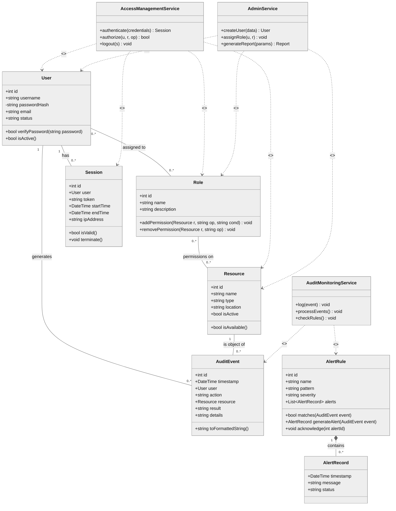
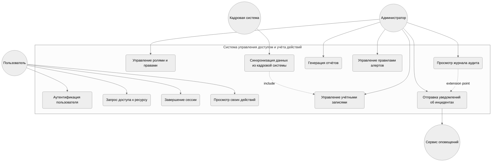
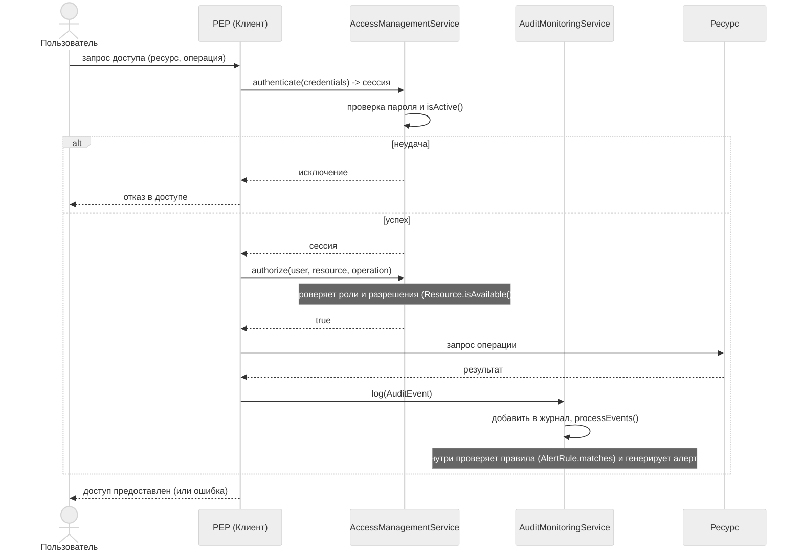
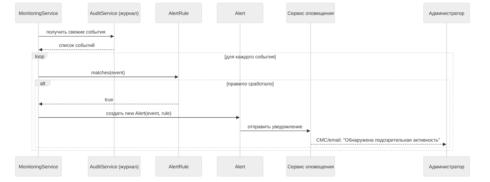

# Лабораторная работа №4  
**Тема:** Объектно-ориентированный анализ с использованием UML для системы управления доступом и учёта действий пользователей

**Цель:** Освоить основы объектно-ориентированного моделирования.

## Задача 1. Выделение классов, атрибутов и методов

На основе анализа предметной области и результатов предыдущих работ (ЛР1–ЛР3) выделены следующие ключевые классы. Классы сгруппированы по слоям: **бизнес-сущности** и **управляющие сервисы**.

| Класс | Тип | Назначение | Ключевые атрибуты | Ключевые методы |
|-------|-----|------------|-------------------|-----------------|
| **User** | Сущность | Учётная запись пользователя | `int id` `string username` `-string passwordHash` `string email` `string status` | `+bool verifyPassword(string password)` `+bool isActive()` |
| **Role** | Сущность | Роль, объединяющая разрешения на ресурсы | `int id` `string name` `string description` | `+void addPermission(Resource r, string op, string cond)` `+void removePermission(Resource r, string op)` |
| **Resource** | Сущность | Защищаемый информационный ресурс | `int id` `string name` `string type` `string location` `bool isActive` | `+bool isAvailable()` |
| **Session** | Сущность | Активная сессия аутентифицированного пользователя | `int id` `User user` `string token` `DateTime startTime` `DateTime endTime` `string ipAddress` | `+bool isValid()` `+void terminate()` |
| **AuditEvent** | Сущность | Запись о событии безопасности | `int id` `DateTime timestamp` `User user` `string action` `Resource resource` `string result` `string details` | `+string toFormattedString()` |
| **AlertRule** | Сущность | Правило корреляции для выявления инцидентов | `int id` `string name` `string pattern` `string severity` `List<AlertRecord> alerts` (композиция) | `+bool matches(AuditEvent event)` `+AlertRecord generateAlert(AuditEvent event)` `+void acknowledge(int alertId)` |
| **AlertRecord** | Сущность (часть AlertRule) | Запись о сгенерированном оповещении | `DateTime timestamp` `string message` `string status` | – |
| **AccessManagementService** | Сервис | Управление доступом (аутентификация, авторизация, сессии) | – | `+Session authenticate(credentials)` `+bool authorize(u, r, op)` `+void logout(s)` |
| **AuditMonitoringService** | Сервис | Аудит событий и мониторинг инцидентов | – | `+void log(event)` `+void processEvents()` `+void checkRules()` |
| **AdminService** | Сервис | Администрирование учётных записей, ролей и отчётов | – | `+User createUser(data)` `+void assignRole(u, r)` `+Report generateReport(params)` |

### Пояснения к структуре

- **AlertRecord** является частью композиции `AlertRule` (сильная связь «целое-часть»). Не имеет собственных методов, управляется через методы `AlertRule`.
- **Сервисы** (`AccessManagementService`, `AuditMonitoringService`, `AdminService`) не обладают собственными атрибутами состояния, а реализуют бизнес-логику, взаимодействуя с сущностями.
- **Методы `addPermission`/`removePermission`** в классе `Role` принимают конкретные параметры (ресурс, операция, условия), а не объект `Permission`, что упрощает программный интерфейс и скрывает детали реализации связи «роль-ресурс» из ER-модели.
- Атрибут `isActive` и метод `isAvailable()` класса `Resource` позволяют динамически управлять доступностью ресурса, не удаляя его из системы.

## Задача 2. Диаграмма классов (Class Diagram)

*Примечание:* для связи «многие ко многим» между User и Role подразумевается ассоциативный класс UserRoleAssignment (на диаграмме не детализирован отдельно для упрощения, но подразумевается через связь с `UserRoleAssignment`).

## Задача 3. Диаграмма прецедентов (Use Case Diagram)

**Актёры:**
- **Пользователь (User)** – штатный сотрудник, запрашивающий доступ к ресурсам.
- **Администратор (Admin)** – управляет ролями, учётными записями и просматривает отчёты.
- **Кадровая система (HR System)** – предоставляет данные о сотрудниках.
- **Сервис оповещения (Notification Service)** – внешняя система для отправки уведомлений (актёр, взаимодействующий с системой).

Пояснения:
- «Синхронизация данных о сотрудниках» инициируется кадровой системой и включает создание/обновление учётных записей (UC4).
- «Отправка уведомлений об инцидентах» включает просмотр журнала аудита (UC6) для администратора, а также взаимодействие с внешним сервисом оповещения.

## Задача 4. Диаграмма последовательности (Sequence Diagram)

**Сценарий:** успешный доступ пользователя к защищённому ресурсу с аутентификацией и авторизацией.

**Участники:**  
- Пользователь,  
- клиентское приложение (PEP),  
- AuthService,  
- AccessControlService,  
- AuditService,  
- Ресурс (целевая система),  
- MonitoringService (фоновый сервис).

**Сценарий «Отправка алерта при обнаружении аномалии» (дополнительный):**

## Описание классов и сценариев

**Классы-сущности** (User, Role, Resource, Permission, Session, AuditEvent, Alert, AlertRule) являются основой доменной модели. Они инкапсулируют данные и минимальное поведение: проверка пароля, проверка активности сессии, сопоставление правила событию.  
**Сервисные классы** реализуют основную бизнес-логику:
- **AuthService** отвечает за идентификацию и аутентификацию, создание и завершение сессий.
- **AccessControlService** принимает решение об авторизации на основе назначенных пользователю ролей и разрешений.
- **AuditService** централизованно собирает события от разных компонентов и сохраняет их.
- **MonitoringService** в асинхронном режиме анализирует журнал событий и по правилам (AlertRule) генерирует оповещения.
- **AdminService** предоставляет интерфейс для управления учётными записями, ролями, разрешениями и формирования отчётов.

Взаимодействие объектов проиллюстрировано диаграммой последовательности, где чётко разделены этапы аутентификации и авторизации, а также асинхронная обработка событий мониторингом.
