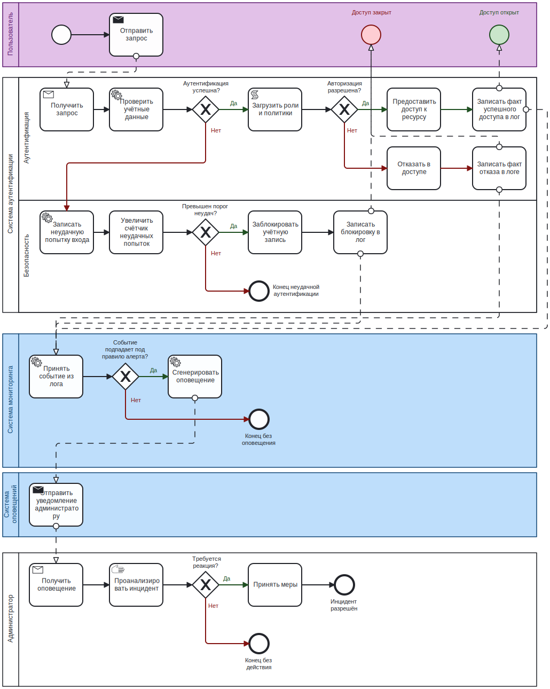

# Лабораторная работа №6
**Тема:** Анализ бизнес-процессов с использованием BPMN для системы управления доступом и учёта действий пользователей

## Задача 1. Ключевой бизнес-процесс

**Наименование процесса:** «Обработка запроса доступа и аудит действий пользователя».

**Цель процесса:** обеспечить безопасный доступ пользователя к ресурсу с полным протоколированием всех значимых событий и оповещением администратора при подозрительной активности.

**Границы процесса:**
- **Старт:** пользователь отправляет учётные данные и запрос к ресурсу.
- **Завершение:** доступ предоставлен, либо пользователь заблокирован/получил отказ, а все события записаны и при необходимости обработаны мониторингом.

## Задача 2. BPMN-диаграмма процесса

Диаграмма выполнена в нотации BPMN 2.0 и содержит шесть дорожек (участников). Ниже приведено её словесное описание, соответствующее сгенерированному изображению.

**Участники (дорожки):**
- Пользователь
- Система (IAM)
- Система (Мониторинг)
- Сервис оповещений
- Администратор

**Элементы диаграммы (в порядке потока управления):**

1. **Стартовое событие** – на дорожке «Пользователь».
2. **Задача «Отправить запрос (логин/пароль, ресурс)»** – Пользователь.
3. **Задача «Получить запрос»** – Система (IAM).
4. **Задача «Проверить учётные данные»** – Система (IAM).
5. **Эксклюзивный шлюз «Аутентификация успешна?»** – Система (IAM).
   - *Ветка «Нет»*:
     - Задача «Записать неудачную попытку входа» – Система (IAM).
     - Задача «Увеличить счётчик неудачных попыток» – Система (IAM).
     - Эксклюзивный шлюз «Превышен порог неудач?» – Система (IAM).
       - *Ветка «Да»*: Задача «Заблокировать учётную запись» и Задача «Записать блокировку в лог» – Система (IAM).
       - *Ветка «Нет»*: Переход к конечному событию (завершение без доступа).
   - *Ветка «Да»*:
     - Задача «Загрузить роли и политики» – Система (IAM).
6. **Эксклюзивный шлюз «Авторизация разрешена?»** – Система (IAM).
   - *Ветка «Нет»*:
     - Задача «Отказать в доступе» – Система (IAM).
     - Задача «Записать факт отказа в логе» – Система (IAM).
   - *Ветка «Да»*:
     - Задача «Предоставить доступ к ресурсу» – Система (IAM).
     - Задача «Записать факт успешного доступа в лог» – Система (IAM).
7. После любой записи в лог управление переходит к дорожке «Система (Мониторинг)».
8. **Задача «Принять событие из лога»** – Система (Мониторинг).
9. **Эксклюзивный шлюз «Событие подпадает под правило алерта?»** – Система (Мониторинг).
   - *Ветка «Нет»*: Конечное событие.
   - *Ветка «Да»*:
     - Задача «Сгенерировать оповещение» – Система (Мониторинг).
10. Переход на дорожку «Сервис оповещений» – задача «Отправить уведомление администратору».
11. Переход на дорожку «Администратор» – задача «Получить оповещение».
12. Задача «Проанализировать инцидент» – Администратор.
13. Эксклюзивный шлюз «Требуется реакция?» – Администратор.
    - *Ветка «Да»*: Задача «Принять меры (разблокировка, расследование)» – Администратор.
    - *Ветка «Нет»*: Конечное событие.
14. **Конечные события** – несколько точек выхода в зависимости от ветки.

Использованы только эксклюзивные шлюзы, так как в каждой точке ветвления реализуется строго один путь. Поток управления проходит через всех участников последовательно.

## Задача 3. Описание ролей, событий, шлюзов, потоков данных

### Роли (участники процесса)

| Участник | Функции в процессе |
|----------|-------------------|
| **Пользователь** | Инициирует запрос, передаёт учётные данные. |
| **Система (IAM)** | Выполняет аутентификацию, авторизацию, ведение счётчиков, блокировку, запись всех фактов в лог. |
| **Система (Мониторинг)** | Принимает события аудита, проверяет корреляционные правила, генерирует оповещения при совпадении. |
| **Сервис оповещений** | Обеспечивает доставку уведомлений администратору по различным каналам (email, SMS, мессенджер). |
| **Администратор** | Получает оповещения, анализирует инциденты, принимает меры (разблокировка, изменение политик). |

### События

| Тип события | Расположение | Описание |
|-------------|--------------|----------|
| **Стартовое** | Пользователь | Начало процесса – отправка запроса доступа. |
| **Конечные** | Разные дорожки | Нормальное завершение после успешного доступа, отказа без блокировки, или после обработки алерта. |

### Шлюзы

| Шлюз | Тип | Описание |
|------|-----|----------|
| Аутентификация успешна? | Эксклюзивный (XOR) | Определяет, корректен ли пароль. При ошибке переходит к учёту неудачной попытки и проверке порога. |
| Превышен порог неудач? | Эксклюзивный | Если количество неудачных попыток превысило лимит – блокировка учётной записи, иначе просто отказ. |
| Авторизация разрешена? | Эксклюзивный | Проверяет наличие у пользователя необходимых прав на ресурс. При отсутствии – запись отказа. |
| Событие подпадает под правило алерта? | Эксклюзивный | Анализирует событие аудита на соответствие корреляционным правилам. При совпадении – инициирует оповещение. |
| Требуется реакция? | Эксклюзивный | Администратор после анализа решает, нужно ли предпринимать активные действия. |

Все шлюзы эксклюзивные, поскольку процесс никогда не идёт одновременно по нескольким веткам.

### Потоки данных (Data Objects)

На диаграмме неявно присутствуют следующие информационные объекты:

- **Учётные данные** (логин/пароль) – передаются от пользователя к задаче «Проверить учётные данные».
- **Результат аутентификации** – бинарный статус и счётчик неудачных попыток, используется в шлюзе «Аутентификация успешна?».
- **Роли и политики** – загружаются из хранилища для задачи «Загрузить роли и политики».
- **Вердикт авторизации** – разрешение или отказ, управляет шлюзом «Авторизация разрешена?».
- **Журнальная запись** – создаётся после любого события: успешный вход, отказ, блокировка. Помещается в лог.
- **Событие аудита** – извлекается мониторингом из лога.
- **Оповещение** – структурированное сообщение, передаваемое сервису оповещений.
- **Реакция администратора** – внешнее воздействие на систему (разблокировка, изменение конфигурации).

## Задача 4. Анализ возможностей оптимизации процесса

Проанализировав текущую модель, можно предложить следующие направления улучшения.

1. **Адаптивная многофакторная аутентификация.**  
   После успешной проверки пароля можно добавить шлюз «Контекст подозрителен?», проверяющий IP-адрес, геолокацию, время и устройство. При высоком риске запускается дополнительная задача «Запросить второй фактор», что повышает безопасность без значительного ухудшения UX.

2. **Кэширование авторизационных решений.**  
   Для повторяющихся запросов одного пользователя к одному и тому же ресурсу в рамках сессии можно включить задачу «Проверить кеш авторизации» перед загрузкой ролей и политик. Это сокращает задержку и нагрузку на PDP.

3. **Автоматическая временная разблокировка.**  
   Вместо ручной разблокировки администратором можно добавить промежуточное событие-таймер после блокировки: через 15–30 минут учётная запись автоматически разблокируется, а в лог пишется соответствующая запись. Это снижает число обращений в службу поддержки.

4. **Динамический порог неудачных попыток.**  
   Заменить жёсткий лимит на риск-ориентированный подход: ML-модель оценивает вероятность атаки и варьирует порог. Это не меняет структуру диаграммы, но изменяет логику шлюза «Превышен порог неудач?».

5. **Асинхронная обработка мониторинга.**  
   Хотя на схеме мониторинг запускается синхронно после записи в лог, на практике можно вынести «Принять событие из лога» в отдельный пул с событием-сообщением, чтобы не задерживать основной поток доступа. В диаграмме это можно отразить потоком сообщений между пулами «IAM» и «Мониторинг».

6. **Уведомление пользователя о блокировке.**  
   После задачи «Заблокировать учётную запись» параллельно можно отправить уведомление владельцу учётной записи (например, по email), чтобы информировать его о причине и возможных действиях.

Эти улучшения не меняют кардинально логику, но делают систему более отказоустойчивой, быстрой и дружественной к легитимным пользователям.
